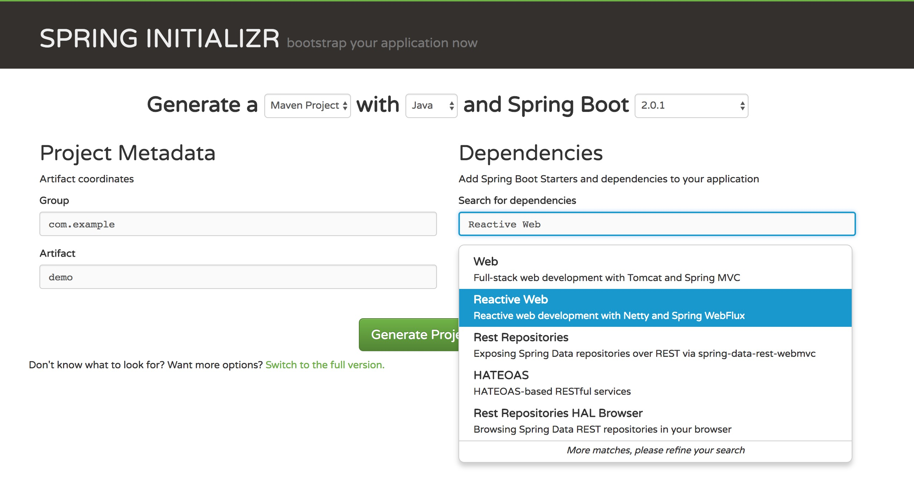

# 1 Spring Boot 2.0 WebFlux

### 了解 WebFlux ,首先了解下什么是 Reactive Streams。Reactive Streams 是 JVM 中面向流的库标准和规范：

- 处理可能无限数量的元素
- 按顺序处理
- 组件之间异步传递
- 强制性非阻塞背压（Backpressure）

### Backpressure(背压)

背压是一种常用策略，使得发布者拥有无限制的缓冲区存储元素，用于确保发布者发布元素太快时，不会去压制订阅者。

### Reactive Streams（响应式流）

一般由以下组成：

- 发布者：发布元素到订阅者
- 订阅者：消费元素
- 订阅：在发布者中，订阅被创建时，将与订阅者共享
- 处理器：发布者与订阅者之间处理数据-

### 响应式编程

有了 Reactive Streams 这种标准和规范，利用规范可以进行响应式编程。那再了解下什么是 Reactive programming 响应式编程。响应式编程是基于异步和事件驱动的非阻塞程序，只是垂直通过在 JVM 内启动少量线程扩展，而不是水平通过集群扩展。这就是一个编程范例，具体项目中如何体现呢？

响应式项目编程实战中，通过基于 Reactive Streams 规范实现的框架 Reactor 去实战。Reactor 一般提供两种响应式 API ：

- Mono：实现发布者，并返回 0 或 1 个元素
- Flux：实现发布者，并返回 N 个元素

### Spring Webflux

Spring Boot Webflux 就是基于 Reactor 实现的。Spring Boot 2.0 包括一个新的 spring-webflux 模块。该模块包含对响应式 HTTP 和 WebSocket 客户端的支持，以及对 REST，HTML 和 WebSocket 交互等程序的支持。一般来说，Spring MVC 用于同步处理，Spring Webflux 用于异步处理。

Spring Boot Webflux 有两种编程模型实现，一种类似 Spring MVC 注解方式，另一种是使用其功能性端点方式。注解的会在第二篇文章讲到，下面快速入门用 Spring Webflux 功能性方式实现。

### Spring Boot 2.0 WebFlux 特性

常用的 Spring Boot 2.0 WebFlux 生产的特性如下：

- 响应式 API
- 编程模型
- 适用性
- 内嵌容器
- Starter 组件

还有对日志、Web、消息、测试及扩展等支持。

### 响应式 API

Reactor 框架是 Spring Boot Webflux 响应库依赖，通过 Reactive Streams 并与其他响应库交互。提供了 两种响应式 API : Mono 和 Flux。一般是将 Publisher 作为输入，在框架内部转换成 Reactor 类型并处理逻辑，然后返回 Flux 或 Mono 作为输出。

适用性


一图就很明确了，WebFlux 和 MVC 有交集，方便大家迁移。但是注意：

- MVC 能满足场景的，就不需要更改为 WebFlux。
- 要注意容器的支持，可以看看下面内嵌容器的支持。
- 微服务体系结构，WebFlux 和 MVC 可以混合使用。尤其开发 IO 密集型服务的时候，选择 WebFlux 去实现。

### 编程模型

Spring 5 web 模块包含了 Spring WebFlux 的 HTTP 抽象。类似 Servlet API , WebFlux 提供了 WebHandler API 去定义非阻塞 API 抽象接口。可以选择以下两种编程模型实现：

- 注解控制层。和 MVC 保持一致，WebFlux 也支持响应性 @RequestBody 注解。
- 功能性端点。基于 lambda 轻量级编程模型，用来路由和处理请求的小工具。和上面最大的区别就是，这种模型，全程控制了请求 - 响应的生命流程

### 内嵌容器

跟 Spring Boot 大框架一样启动应用，但 WebFlux 默认是通过 Netty 启动，并且自动设置了默认端口为 8080。另外还提供了对 Jetty、Undertow 等容器的支持。开发者自行在添加对应的容器 Starter 组件依赖，即可配置并使用对应内嵌容器实例。

但是要注意，必须是 Servlet 3.1+ 容器，如 Tomcat、Jetty；或者非 Servlet 容器，如 Netty 和 Undertow.

### Starter 组件

跟 Spring Boot 大框架一样，Spring Boot Webflux 提供了很多 “开箱即用” 的 Starter 组件。Starter 组件是可被加载在应用中的 Maven 依赖项。只需要在 Maven 配置中添加对应的依赖配置，即可使用对应的 Starter 组件。例如，添加 spring-boot-starter-webflux 依赖，就可用于构建响应式 API 服务，其包含了 Web Flux 和 Tomcat 内嵌容器等。

开发中，很多功能是通过添加 Starter 组件的方式来进行实现。那么，Spring Boot 2.x 常用的 Starter 组件有哪些呢？

### Spring Boot 2.0 WebFlux 组件

Spring Boot WebFlux 官方提供了很多 Starter 组件，每个模块会有多种技术实现选型支持，来实现各种复杂的业务需求：

- Web：Spring WebFlux
- 模板引擎：Thymeleaf
- 存储：Redis、MongoDB、Cassandra。不支持 MySQL
- 内嵌容器：Tomcat、Jetty、Undertow

# 2 快速入门

### Spring Initializr 快速构建项目骨架

Spring Boot Maven 工程，就是普通的 Maven 工程，加入了对应的 Spring Boot 依赖即可。Spring Initializr 则是像代码生成器一样，自动就给你出来了一个 Spring Boot Maven 工程。Spring Initializr 有两种方式可以得到 Spring Boot Maven 骨架工程：

start.spring.io 在线生成
Spring 官方提供了名为 Spring Initializr 的网站，去引导你快速生成 Spring Boot 应用。网站地址为：https://start.spring.io，操作步骤如下：

第一步，选择 Maven 或者 Gradle 构建工具，开发语言 Java 、Kotlin 或者 Groovy，最后确定 Spring Boot 版本号。这里默认选择 Maven 构建工具、Java 开发语言和 Spring Boot 2.0.1。

第二步，输入 Maven 工程信息，即项目组 groupId 和名字 artifactId。这里对应 Maven 信息为：

groupId：springboot
artifactId：sspringboot-webflux-1-quickstart
这里默认版本号 version 为 0.0.1-SNAPSHOT 。三个属性在 Maven 依赖仓库是唯一标识的。

第三步，选择工程需要的 Starter 组件和其他依赖。最后点击生成按钮，即可获得骨架工程压缩包。这里快速入门，只要选择 Reactive Web 即可。如图 1-8 所示。



### 配置 POM 依赖

```xml
  <dependencies>
    <dependency>
      <groupId>org.springframework.boot</groupId>
      <artifactId>spring-boot-starter-webflux</artifactId>
    </dependency>

    <dependency>
      <groupId>org.springframework.boot</groupId>
      <artifactId>spring-boot-starter-test</artifactId>
      <scope>test</scope>
    </dependency>
    <dependency>
      <groupId>io.projectreactor</groupId>
      <artifactId>reactor-test</artifactId>
      <scope>test</scope>
    </dependency>
  </dependencies>

  <build>
    <plugins>
      <plugin>
        <groupId>org.springframework.boot</groupId>
        <artifactId>spring-boot-maven-plugin</artifactId>
      </plugin>
    </plugins>
  </build>

```

```grvooy
plugins {
    id 'org.springframework.boot' version '2.1.5.RELEASE'
    id 'java'
}

apply plugin: 'io.spring.dependency-management'

group = 'com.spring'
version = '1.0.0'
sourceCompatibility = '1.8'

repositories {
    mavenLocal()
    maven {
        url 'http://maven.aliyun.com/nexus/content/groups/public/'
    }
}

dependencies {
    
    implementation 'org.springframework.boot:spring-boot-starter-webflux'
    testImplementation 'org.springframework.boot:spring-boot-starter-test'
    testImplementation 'io.projectreactor:reactor-test'
}
```
spring-boot-starter-webflux 依赖，是我们核心需要学习 webflux 的包，里面默认包含了 spring-boot-starter-reactor-netty 、spring 5 webflux 包。也就是说默认是通过 netty 启动的。

reactor-test、spring-boot-starter-test 两个依赖搭配是用于单元测试。

spring-boot-maven-plugin 是 Spring Boot Maven 插件，可以运行、编译等调用。

### 编写处理器类 Handler

新建包 com.spring.webflux.handler ，作为编写功能处理类。新建城市（City）例子的处理类 CityHandler，代码如下：

```java
package com.spring.webflux.handler;

import org.springframework.http.MediaType;
import org.springframework.stereotype.Component;
import org.springframework.web.reactive.function.BodyInserters;
import org.springframework.web.reactive.function.server.ServerRequest;
import org.springframework.web.reactive.function.server.ServerResponse;
import reactor.core.publisher.Mono;

@Component
public class CityHandler {

    public Mono<ServerResponse> helloCity(ServerRequest request) {
        return ServerResponse.ok().contentType(MediaType.TEXT_PLAIN)
                .body(BodyInserters.fromObject("Hello, City!"));
    }

}
```

ServerResponse 是对响应的封装，可以设置响应状态，响应头，响应正文。比如 ok 代表的是 200 响应码、MediaType 枚举是代表这文本内容类型、返回的是 String 的对象。

这里用 Mono 作为返回对象，是因为返回包含了一个 ServerResponse 对象，而不是多个元素。

### 编写路由器类 Router

新建 com.spring.webflux.router 包，作为编写路由器类。新建城市（City）例子的路由类 CityRouter，代码如下：

```java
package com.spring.webflux.config;

import com.spring.webflux.handler.CityHandler;
import org.springframework.context.annotation.Bean;
import org.springframework.context.annotation.Configuration;
import org.springframework.http.MediaType;
import org.springframework.web.reactive.function.server.RequestPredicates;
import org.springframework.web.reactive.function.server.RouterFunction;
import org.springframework.web.reactive.function.server.RouterFunctions;
import org.springframework.web.reactive.function.server.ServerResponse;

/**
 * @author xuweizhi
 * @since 2019/05/26 11:42
 */
@Configuration
public class CityRouter {


    @Bean
    public RouterFunction<ServerResponse> routeCity(CityHandler cityHandler) {
        return RouterFunctions
                .route(RequestPredicates.GET("/hello")
                                .and(RequestPredicates.accept(MediaType.TEXT_PLAIN)),
                        cityHandler::helloCity);
    }

}
```

RouterFunctions 对请求路由处理类，即将请求路由到处理器。这里将一个 GET 请求 /hello 路由到处理器 cityHandler 的 helloCity 方法上。跟 Spring MVC 模式下的 HandleMapping 的作用类似。

RouterFunctions.route(RequestPredicate, HandlerFunction) 方法，对应的入参是请求参数和处理函数，如果请求匹配，就调用对应的处理器函数。

到这里一个简单的服务就写好了，下面怎么运行该服务。


