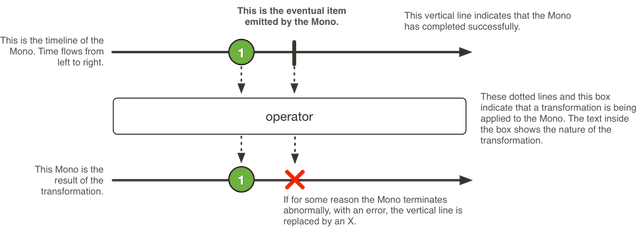
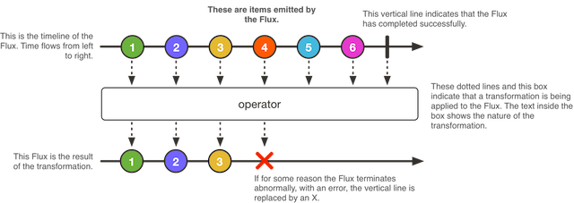

# 对象

新建包 com.spring.webflux.domain ，作为编写城市实体对象类。新建城市（City）对象 City，代码如下：

```java
public class City {

    /**
     * 城市编号
     */
    private Long id;

    /**
     * 省份编号
     */
    private Long provinceId;

    /**
     * 城市名称
     */
    private String cityName;

    /**
     * 描述
     */
    private String description;

    public Long getId() {
        return id;
    }

    public void setId(Long id) {
        this.id = id;
    }

    public Long getProvinceId() {
        return provinceId;
    }

    public void setProvinceId(Long provinceId) {
        this.provinceId = provinceId;
    }

    public String getCityName() {
        return cityName;
    }

    public void setCityName(String cityName) {
        this.cityName = cityName;
    }

    public String getDescription() {
        return description;
    }

    public void setDescription(String description) {
        this.description = description;
    }
}

```
# 数据访问层 CityRepository
@Repository 用于标注数据访问组件，即 DAO 组件。实现代码中使用名为 repository 的 Map 对象作为内存数据存储，并对对象具体实现了具体业务逻辑。CityRepository 负责将 Book 持久层（数据操作）相关的封装组织，完成新增、查询、删除等操作。

这里不会涉及到数据存储这块，具体数据存储会在后续介绍。

```java
/**
 * .@Repository 用于标注数据访问组件，即 DAO 组件。实现代码中使用名为 repository 的 Map 对象作为内存数据存储，并对对象具体实现了具体业务逻辑。
 * CityRepository 负责将 Book 持久层（数据操作）相关的封装组织，完成新增、查询、删除等操作。
 * <p>
 * 这里不会涉及到数据存储这块，具体数据存储会在后续介绍。
 *
 * @author xuweizhi
 * @since 2019/05/26 11:52
 */
@Repository
public class CityRepository {

    private ConcurrentMap<Long, City> repository = new ConcurrentHashMap<>();

    private static final AtomicLong idGenerator = new AtomicLong(0);

    public Long save(@NotNull City city) {
        Long id = idGenerator.incrementAndGet();
        city.setId(id);
        repository.put(id, city);
        return id;
    }

    public Collection<City> findAll() {
        return repository.values();
    }


    public City findCityById(Long id) {
        return repository.get(id);
    }

    public Long updateCity(City city) {
        repository.put(city.getId(), city);
        return city.getId();
    }

    public Long deleteCity(Long id) {
        repository.remove(id);
        return id;
    }
}

```
# 处理器类 Handler


```java
@Component
public class CityHandler {
    private final CityRepository cityRepository;

    /**
     * 构造注入
     */
    @Contract(pure = true)
    @Autowired
    public CityHandler(CityRepository cityRepository) {
        this.cityRepository = cityRepository;
    }

    /**
     * 从返回值可以看出，Mono 和 Flux 适用于两个场景，即：
     * <ul>
     * <li>Mono：实现发布者，并返回 0 或 1 个元素，即单对象</li>
     * <li>Flux：实现发布者，并返回 N 个元素，即 List 列表对象</li>
     * </ul>
     */
    //public Mono<ServerResponse> helloCity(ServerRequest request) {
    //    return ServerResponse.ok().contentType(MediaType.TEXT_PLAIN)
    //            .body(BodyInserters.fromObject("Hello, City!"));
    //}

    public Mono<Long> save(City city) {
        return Mono.create(
                cityMonoSink ->
                        cityMonoSink.success(cityRepository.save(city))
        );
    }

    public Mono<City> findCityById(Long id) {
        return Mono.justOrEmpty(cityRepository.findCityById(id));
    }

    public Flux<City> findAllCity() {
        return Flux.fromIterable(cityRepository.findAll());
    }

    public Mono<Long> modifyCity(City city) {
        return Mono.create(cityMonoSink -> cityMonoSink.success(cityRepository.updateCity(city)));
    }

    public Mono<Long> deleteCity(Long id) {
        return Mono.create(cityMonoSink -> cityMonoSink.success(cityRepository.deleteCity(id)));
    }

}
```

# Mono

Mono 是什么？ 官方描述如下：A Reactive Streams Publisher with basic rx operators that completes successfully by emitting an element, or with an error.

Mono 是响应流 Publisher ，即要么成功发布元素，要么错误。如图所示：



Mono 常用的方法有：

- Mono.create()：使用 MonoSink 来创建 Mono
- Mono.justOrEmpty()：从一个 Optional 对象或 null 对象中创建 Mono。
- Mono.error()：创建一个只包含错误消息的 Mono
- Mono.never()：创建一个不包含任何消息通知的 Mono
- Mono.delay()：在指定的延迟时间之后，创建一个 Mono，产生数字 0 作为唯一值

# Flux

Flux 是什么？ 官方描述如下：A Reactive Streams Publisher with rx operators that emits 0 to N elements, and then completes (successfully or with an error).

Flux 是响应流 Publisher ，即要么成功发布 0 到 N 个元素，要么错误。Flux 其实是 Mono 的一个补充。如图所示：



所以要注意：如果知道 Publisher 是 0 或 1 个，则用 Mono。

Flux 最值得一提的是 fromIterable 方法。fromIterable(Iterable<? extends T> it) 可以发布 Iterable 类型的元素。当然，Flux 也包含了基础的操作：map、merge、concat、flatMap、take，这里就不展开介绍了。

# 控制器类 Controller

Spring Boot WebFlux 也可以使用自动配置加注解驱动的模式来进行开发。

新建包目录 com.spring.webflux.controller ，并在目录中创建名为 CityWebFluxController 来处理不同的 HTTP Restful 业务请求。代码如下：

```java
@RestController
@RequestMapping(value = "/city")
public class CityWebFluxController {

    @Autowired
    private CityHandler cityHandler;

    @GetMapping(value = "/{id}")
    public Mono<City> findCityById(@PathVariable("id") Long id) {
        return cityHandler.findCityById(id);
    }

    @GetMapping
    public Flux<City> findAllCity() {
        return cityHandler.findAllCity();
    }

    @PostMapping
    public Mono<Long> saveCity(@RequestBody City city) {
        return cityHandler.save(city);
    }

    @PutMapping
    public Mono<Long> modifyCity(@RequestBody City city) {
        return cityHandler.modifyCity(city);
    }

    @DeleteMapping(value = "/{id}")
    public Mono<Long> deleteCity(@PathVariable("id") Long id) {
        return cityHandler.deleteCity(id);
    }
}
```
这里按照 REST 风格实现接口。那具体什么是 REST?

REST 是属于 WEB 自身的一种架构风格，是在 HTTP 1.1 规范下实现的。Representational State Transfer 全称翻译为表现层状态转化。Resource：资源。比如 newsfeed；Representational：表现形式，比如用JSON，富文本等；State Transfer：状态变化。通过HTTP 动作实现。

理解 REST ,要明白五个关键要素：

- 资源（Resource）
- 资源的表述（Representation）
- 状态转移（State Transfer）
- 统一接口（Uniform Interface）
- 超文本驱动（Hypertext Driven）

6 个主要特性：

- 面向资源（Resource Oriented）
- 可寻址（Addressability）
- 连通性（Connectedness）
- 无状态（Statelessness）
- 统一接口（Uniform Interface）
- 超文本驱动（Hypertext Driven）